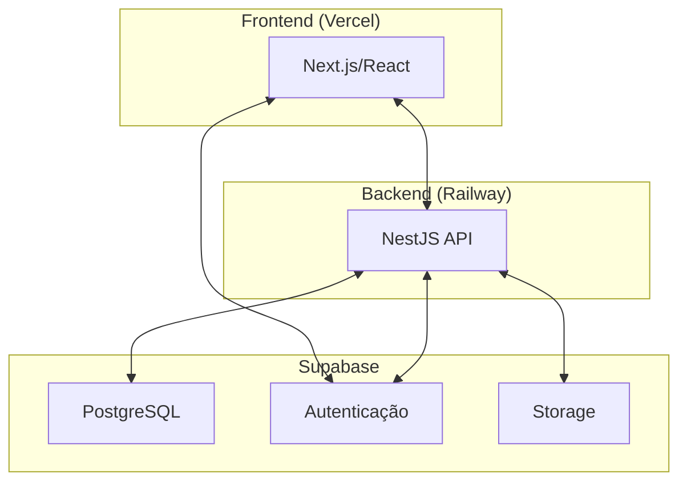
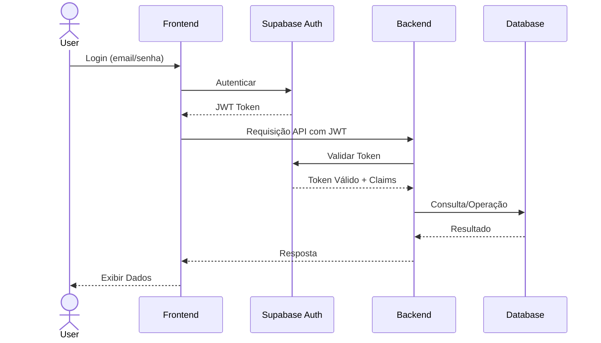
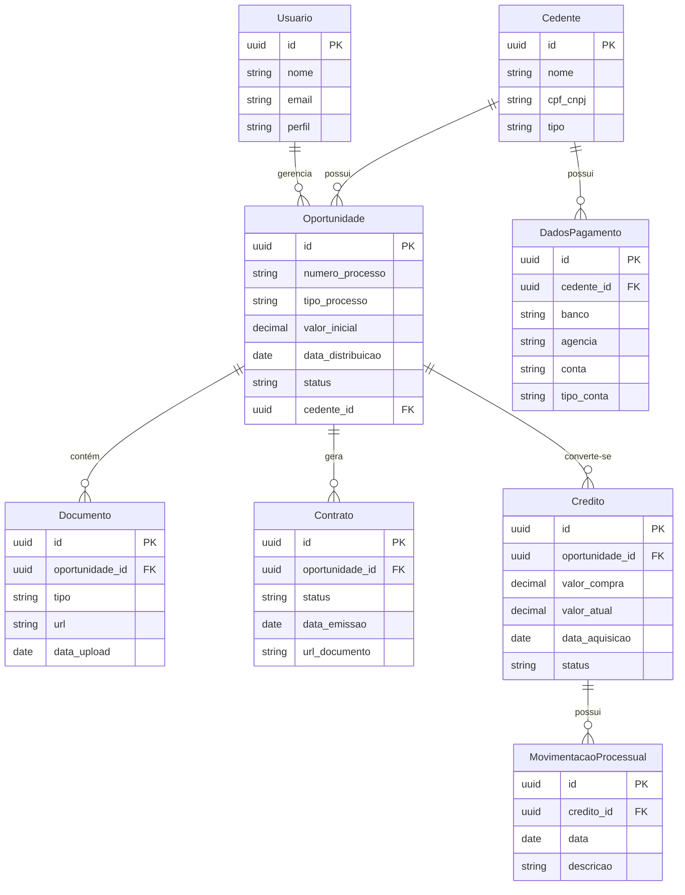

# Sistema de Gestão de Créditos
## Documento de Arquitetura Técnica

**Versão:** 1.0  
**Data:** 25/06/2025  
**Preparado por:** Equipe de Arquitetura

## Sumário Executivo

Este documento apresenta a arquitetura técnica do Sistema de Gestão de Créditos, detalhando as tecnologias, componentes e integrações que compõem a solução. A arquitetura foi projetada para atender aos requisitos funcionais e não-funcionais especificados no documento de especificação funcional, garantindo escalabilidade, segurança e manutenibilidade.

## Visão Geral da Arquitetura

O Sistema de Gestão de Créditos segue uma arquitetura moderna baseada em microserviços, utilizando tecnologias cloud-native para garantir escalabilidade e resiliência. A arquitetura é composta por três camadas principais:

1. **Frontend**: Interface do usuário desenvolvida com Next.js/React e hospedada na Vercel (implementação via lovable.dev)
2. **Backend**: API RESTful desenvolvida com NestJS e hospedada na Railway
3. **Banco de Dados e Autenticação**: Supabase (PostgreSQL + Serviços de Autenticação, com implementação da autenticação via lovable.dev)

## Stack Tecnológica

### Frontend
- **Tecnologia**: Next.js / React
- **Hospedagem**: Vercel
- **Implementação**: Serviço lovable.dev
- **Papel**: Interface do usuário, consumindo APIs do NestJS e serviços do Supabase
- **Principais bibliotecas**:
  - React Query: Gerenciamento de estado e cache de dados
  - Tailwind CSS: Framework CSS para estilização
  - React Hook Form: Gerenciamento de formulários
  - Zod: Validação de esquemas
  - Supabase JS Client: Integração direta com serviços do Supabase

### Backend
- **Tecnologia**: NestJS
- **Hospedagem**: Railway
- **Papel**: Lógica de negócios, validações, integrações externas
- **Principais módulos**:
  - NestJS Core: Framework base
  - TypeORM: ORM para acesso ao banco de dados
  - Passport: Middleware de autenticação
  - Supabase Admin SDK: Integração com serviços do Supabase
  - Swagger: Documentação de API

### Banco de Dados e Autenticação
- **Tecnologia**: Supabase
- **Hospedagem**: Gerenciada pelo Supabase
- **Implementação da Autenticação**: Serviço lovable.dev
- **Papel**: 
  - PostgreSQL: Armazenamento de dados
  - Autenticação: JWT, OAuth, gerenciamento de usuários
  - Storage: Armazenamento de documentos

## Fluxo de Autenticação

1. O usuário realiza login através da interface frontend
2. O frontend se comunica diretamente com o serviço de autenticação do Supabase
3. Após autenticação bem-sucedida, o Supabase retorna um JWT
4. O frontend armazena o token e o utiliza em todas as requisições subsequentes
5. O backend valida o token JWT usando o SDK do Supabase antes de processar requisições
6. Após validação, o backend processa a requisição e retorna os dados necessários

## Modelo de Dados

O modelo de dados foi projetado para suportar os requisitos funcionais do sistema, com foco na gestão de oportunidades de crédito, documentos, contratos e créditos adquiridos.

### Principais Entidades

## Componentes do Sistema

### Módulos do Frontend

1. **Módulo de Autenticação**
   - Login/Logout
   - Recuperação de senha
   - Gerenciamento de perfil

2. **Módulo de Gestão de Oportunidades**
   - Cadastro e listagem de oportunidades
   - Upload de arquivos CSV para importação em massa de oportunidades
   - Template padronizado para planilhas Excel/CSV
   - Classificação e filtros
   - Dashboard de oportunidades

3. **Módulo de Gestão Documental**
   - Upload e visualização de documentos
   - Organização por categorias
   - Controle de versões

4. **Módulo de Contratos**
   - Geração de contratos
   - Visualização de status
   - Coleta de dados para pagamento

5. **Módulo de Créditos Adquiridos**
   - Dashboard de créditos
   - Acompanhamento processual
   - Relatórios e análises

### Módulos do Backend

1. **Módulo de Autenticação e Autorização**
   - Validação de tokens JWT
   - Controle de acesso baseado em perfis
   - Integração com Supabase Auth

2. **Módulo de Oportunidades**
   - CRUD de oportunidades
   - Processamento de arquivos CSV para importação em massa
   - Validação de dados importados
   - Lógica de classificação
   - Cálculos de atualização monetária

3. **Módulo de Documentos**
   - Gerenciamento de uploads
   - Integração com Supabase Storage
   - Validação de documentos

4. **Módulo de Contratos**
   - Geração de contratos
   - Workflow de aprovação
   - Integração com serviços de assinatura digital

5. **Módulo de Créditos**
   - Gestão de créditos adquiridos
   - Acompanhamento processual
   - Alertas e notificações

6. **Módulo de Relatórios**
   - Geração de relatórios
   - Exportação de dados
   - Análises e BI

## Integrações

### Integrações Internas

1. **Frontend → Supabase Auth**
   - Autenticação direta de usuários
   - Gerenciamento de sessões

2. **Frontend → Backend API**
   - Consumo de endpoints para operações de negócio
   - Envio de dados de formulários

3. **Backend → Supabase Database**
   - Operações CRUD no banco de dados
   - Consultas complexas e relatórios

4. **Backend → Supabase Auth**
   - Validação de tokens JWT
   - Verificação de permissões

5. **Backend → Supabase Storage**
   - Armazenamento e recuperação de documentos
   - Gerenciamento de metadados de arquivos

### Integrações Externas (Potenciais)

1. **Serviços de Assinatura Digital**
   - Integração para assinatura de contratos

2. **Sistemas de Tribunais**
   - Consulta de processos judiciais
   - Acompanhamento de movimentações

3. **Serviços de Pagamento**
   - Integração para processamento de pagamentos aos cedentes

## Considerações de Segurança

1. **Autenticação**
   - Utilização de JWT com tempo de expiração adequado
   - Refresh tokens para renovação segura de sessões
   - Autenticação multifator para operações sensíveis

2. **Autorização**
   - Controle de acesso baseado em perfis (RBAC) utilizando claims do JWT
   - Validação de permissões em nível de API no backend NestJS
   - Sem utilização de Row Level Security do PostgreSQL
   - Logs de auditoria para ações sensíveis

3. **Proteção de Dados**
   - Criptografia de dados sensíveis em repouso
   - HTTPS para todas as comunicações
   - Sanitização de inputs para prevenir injeções

4. **Conformidade com LGPD**
   - Consentimento explícito para coleta de dados
   - Mecanismos para exclusão de dados pessoais
   - Registro de operações de tratamento de dados

## Escalabilidade e Desempenho

1. **Estratégias de Escalabilidade**
   - Arquitetura stateless permitindo escalabilidade horizontal
   - Uso de cache para reduzir carga no banco de dados
   - Paginação e limitação de resultados em consultas pesadas

2. **Otimização de Desempenho**
   - Indexação adequada no banco de dados
   - Lazy loading de componentes no frontend
   - Compressão de respostas HTTP

3. **Monitoramento**
   - Logs estruturados para análise de erros
   - Métricas de desempenho e disponibilidade
   - Alertas para comportamentos anômalos

## Estratégia de Implantação

1. **Ambientes**
   - Desenvolvimento: Para desenvolvimento ativo
   - Homologação: Para testes de aceitação
   - Produção: Ambiente final para usuários

2. **CI/CD**
   - GitHub Actions para automação de builds e testes
   - Deploy automático para Vercel (frontend via lovable.dev) e Railway (backend)
   - Testes automatizados antes de cada deploy

3. **Versionamento**
   - Semântico (MAJOR.MINOR.PATCH)
   - Branches protegidas com revisão de código obrigatória
   - Changelogs automáticos

## Próximos Passos

1. **Fase 1: Configuração Inicial**
   - Setup do projeto Next.js (via lovable.dev) e NestJS
   - Configuração do Supabase (banco de dados e autenticação)
   - Implementação do fluxo de autenticação básico (via lovable.dev)
   - Criação do template de planilha Excel para importação de oportunidades

2. **Fase 2: Funcionalidades Core**
   - Módulo de Gestão de Oportunidades
   - Módulo de Gestão Documental
   - Dashboard inicial

3. **Fase 3: Funcionalidades Avançadas**
   - Módulo de Contratos
   - Coleta de dados para pagamento
   - Gestão de Créditos Adquiridos

4. **Fase 4: Refinamentos**
   - Relatórios e análises avançadas
   - Integrações externas
   - Otimizações de desempenho

---

Este documento é uma arquitetura inicial baseada nas informações fornecidas. Ajustes e refinamentos serão realizados conforme feedback dos stakeholders e evolução do entendimento dos requisitos do sistema.
