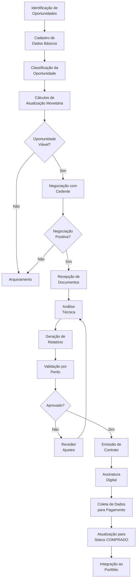
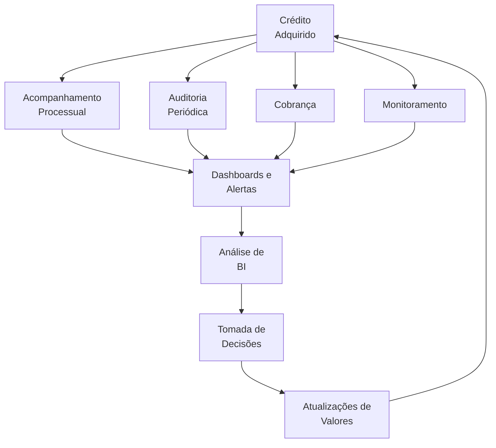

# Sistema de Gestão de Créditos
## Documento de Especificação Funcional

**Versão:** 1.0  
**Data:** 08/06/2025  
**Preparado por:** Product Owner

## Sumário Executivo

Este documento apresenta a especificação funcional do Sistema de Gestão de Créditos, uma solução desenvolvida para gerenciar o processo completo de aquisição e acompanhamento de créditos provenientes de processos judiciais, trabalhistas, precatórios e NPL (Non-Performing Loans). O sistema abrange desde a identificação inicial de oportunidades até o monitoramento contínuo dos créditos adquiridos, proporcionando uma plataforma integrada para maximizar o retorno dos investimentos com governança e controle.

## Visão Geral do Sistema

O Sistema de Gestão de Créditos é uma plataforma que permite o gerenciamento completo do ciclo de vida de créditos adquiridos, desde a identificação de oportunidades até o monitoramento e cobrança dos créditos comprados. O sistema é projetado para suportar o fluxo de trabalho específico de empresas que negociam a compra de direitos creditórios oriundos de processos judiciais.

## Fluxo de Processos

### 1. Ciclo de Vida da Oportunidade de Crédito

### 2. Ciclo de Gestão do Crédito Adquirido

## Requisitos Funcionais

### 1. Gestão de Oportunidades

#### 1.1 Identificação e Cadastro de Oportunidades
- **Descrição:** O sistema deve permitir o cadastro de novas oportunidades de crédito provenientes de diversas fontes.
- **Dados a serem registrados:**
  - Número do processo
  - Tipo de processo
  - Valor inicial
  - Data de distribuição
  - CPF e nome do cedente
  - Informações adicionais relevantes

#### 1.2 Classificação de Oportunidades
- **Descrição:** O sistema deve permitir a classificação das oportunidades para definir a trilha de análise e riscos associados.
- **Categorias de classificação:**
  - NPL (Non-Performing Loans)
  - Precatórios
  - Processos Trabalhistas
  - Processos Cíveis
  - Outros tipos conforme necessidade

#### 1.3 Cálculos de Atualização Monetária
- **Descrição:** O sistema deve possibilitar a realização de cálculos para determinar o valor atual do processo.
- **Funcionalidades:**
  - Aplicação de cálculos a definir

#### 1.4 Negociação com Cedentes
- **Descrição:** A negociação com cedentes deve ser feita diretamente pelo cliente, sem interação do sistema.

### 2. Gestão Documental

#### 2.1 Recepção e Armazenamento de Documentos
- **Descrição:** O sistema deve permitir o recebimento e armazenamento de documentos necessários para a análise e emissão de contrato.
- **Funcionalidades:**
  - Integração com sistema/serviço cloud de terceiros para armazenamento
  - Categorização de documentos
  - Controle de versões
  - Checklist de documentos necessários (a definir)

#### 2.2 Análise Documental e Processual
- **Descrição:** O sistema deve suportar o processo de análise técnica dos documentos e do processo.
- **Funcionalidades:**
  - Registro de análises realizadas
  - Avaliação de riscos
  - Análise de garantias
  - Determinação de recuperabilidade
  - Definição de preço-alvo

#### 2.3 Geração de Relatórios
- **Descrição:** O sistema deve permitir a geração de relatórios com informações do processo e valores para envio ao perito.
- **Funcionalidades:**
  - Modelos personalizáveis de relatórios
  - Exportação em diferentes formatos (PDF, Excel)
  
#### 2.4 Gestão de Pareceres Técnicos
- **Descrição:** O sistema deve permitir o registro e acompanhamento de pareceres técnicos emitidos por peritos.
- **Funcionalidades:**
  - Cadastro de peritos (internos e externos)
  - Registro de pareceres
  - Tudo via documentos armazenados no sistema

### 3. Gestão de Contratos

#### 3.1 Emissão de Contratos de Cessão
- **Descrição:** O sistema deve suportar a geração de contratos de cessão de créditos.
- **Funcionalidades:**
  - Modelos de contratos personalizáveis
  - Preenchimento automático com dados do processo
  - Versionamento de contratos

#### 3.2 Assinatura Digital
- **Descrição:** O sistema armazenará os contratos assinados digitalmente por todas as partes envolvidas.
- **Funcionalidades:**
  - Armazenamento seguro em serviço cloud de terceiros

#### 3.3 Coleta de Dados para Pagamento
- **Descrição:** O sistema deve permitir a coleta e armazenamento dos dados bancários e informações necessárias para efetuar o pagamento ao cedente.
- **Funcionalidades:**
  - Cadastro de dados bancários do cedente
  - Registro de informações fiscais necessárias (se necessário)
  - Armazenamento seguro das informações financeiras

#### 3.4 Atualização de Status
- **Descrição:** O sistema deve permitir a atualização do status da oportunidade para COMPRADO (a definir) após a finalização do processo de aquisição.
- **Funcionalidades:**
  - Workflow de aprovação
  - Registro de data efetiva da compra
  - Notificações automáticas

### 4. Gestão de Créditos Adquiridos

#### 4.1 Acompanhamento Processual
- **Descrição:** O sistema deve permitir o acompanhamento processual dos créditos adquiridos.
- **Funcionalidades:**
  - Registro de movimentações processuais
  - Alertas de prazos
  - Integração com sistemas de tribunais (quando disponível)

#### 4.2 Auditoria
- **Descrição:** O sistema deve suportar processos de auditoria dos créditos adquiridos.
- **Funcionalidades:**
  - Registro de informações pertinentes a auditoria (usuários, data, ações, etc)

#### 4.3 Monitoramento
- **Descrição:** O sistema deve permitir o monitoramento contínuo dos créditos adquiridos.
- **Funcionalidades:**
  - Dashboards
  - Alertas
  - Relatórios

## Requisitos Não-Funcionais

### 1. Segurança
- Autenticação de usuários
- Registro de logs de auditoria
- Conformidade com LGPD

### 2. Usabilidade
- Interface intuitiva e responsiva
- Tempos de resposta adequados

### 3. Disponibilidade
- Disponibilidade 24/7 com manutenções programadas

### 4. Escalabilidade
- Capacidade de crescimento conforme aumento da base de dados

### 5. Integrações
- APIs para integração com sistemas externos
- Integração com serviços cloud para armazenamento de documentos

## Próximos Passos

1. Validação do documento com stakeholders
2. Detalhamento de requisitos específicos
3. Priorização de funcionalidades
4. Elaboração de cronograma

---

Este documento é uma especificação inicial baseada nas informações fornecidas. Ajustes e refinamentos serão realizados conforme feedback dos stakeholders e evolução do entendimento dos requisitos do sistema.
